# 🛍️ Bictox Online Shopping

> > ### 🚀 Buy It Conveniently Through Online Experience

Bictox Online Shopping is a modern full-stack AI-powered ecommerce platform built using the MERN stack. It provides a secure shopping experience with authentication, smart product search, wishlist, cart management, Razorpay payment integration, order management, and an intelligent shopping assistant called **Bictox AI**.

The project was developed as a real-world internship-level ecommerce application with production-oriented architecture, clean UI, responsive design, and secure backend APIs.

---

# 🚀 Features

## 👤 Authentication System

- User Registration
- Secure Login
- JWT Authentication
- Email OTP Verification
- Forgot Password
- Password Reset
- Protected Routes
- Password Hashing using bcrypt

---

## 🛍️ Shopping Features

- Browse Products
- Product Categories
- Product Search
- Product Details
- Smart Product Recommendations
- Wishlist
- Shopping Cart
- Buy Now
- Checkout
- Address Management
- Order History
- Order Tracking

---

## 💳 Payment

- Razorpay Payment Gateway
- Secure Order Verification
- Payment Status Management

---

## ⭐ Reviews

- Product Reviews
- Product Ratings
- Update Reviews
- Delete Reviews

---

## 🤖 Bictox Online Shopping Assistant

- AI Chat Interface
- Budget Shopping
- Product Recommendation
- Product Comparison
- Product Preview
- Smart Shopping Assistance
- Chat History
- Responsive Chat Layout

---

## 👨‍💼 Admin Features

- Admin Authentication
- Product Management
- Order Management
- Dashboard APIs
- Role Based Access Control (RBAC)

---

## 🎨 User Interface

- Modern Responsive Design
- Mobile Friendly
- Professional Navigation
- Responsive Footer
- Interactive Product Cards
- Animated Hero Sections
- React Icons Integration
- Clean User Experience

---

# 🛠️ Tech Stack

## Frontend

- React.js
- Vite
- Tailwind CSS
- React Router DOM
- Axios
- React Hot Toast
- React Icons

---

## Backend

- Node.js
- Express.js
- MongoDB Atlas
- Mongoose
- JWT
- bcryptjs
- Nodemailer
- Multer
- Razorpay

---

## Database

- MongoDB Atlas

---

# 📂 Project Structure

```text
Bictox-Online-Shopping/
│
├── client/
│   ├── public/
│   ├── src/
│   │   ├── assets/
│   │   ├── components/
│   │   ├── layouts/
│   │   ├── pages/
│   │   ├── routes/
│   │   ├── services/
│   │   ├── utils/
│   │   ├── App.jsx
│   │   ├── main.jsx
│   │   └── index.css
│   │
│   ├── package.json
│   └── vite.config.js
│
├── server/
│   ├── config/
│   ├── controllers/
│   ├── middleware/
│   ├── models/
│   ├── public/
│   ├── routes/
│   ├── services/
│   ├── utils/
│   ├── server.js
│   ├── package.json
│   └── .env
│
├── README.md
└── .gitignore
```

---

# ⚙️ Installation

## 1. Clone the Repository

```bash
git clone https://github.com/<your-username>/Bictox-Online-Shopping.git
```

---

## 2. Go to Project Directory

```bash
cd Bictox-Online-Shopping
```

---

## 3. Install Frontend Dependencies

```bash
cd client
npm install
```

---

## 4. Install Backend Dependencies

```bash
cd ../server
npm install
```

---

# ▶️ Running the Project

## Start Backend

```bash
cd server
npm run dev
```

Backend will run on:

```
http://localhost:5000
```

---

## Start Frontend

Open another terminal:

```bash
cd client
npm run dev
```

Frontend will run on:

```
http://localhost:5173
```

---

# 🔐 Environment Variables

Create a `.env` file inside the **server** folder and add the following variables:

```env
PORT=5000

MONGO_URI=your_mongodb_connection_string

JWT_SECRET=your_jwt_secret_key

EMAIL_USER=your_email@gmail.com
EMAIL_PASS=your_gmail_app_password

RAZORPAY_KEY_ID=your_razorpay_key_id
RAZORPAY_KEY_SECRET=your_razorpay_key_secret
```

> ⚠️ Never upload your `.env` file to GitHub.

# 📅 Development Journey

The Bictox Online Shopping project was developed over approximately **32 days**, following a structured day-wise roadmap.

| Phase  | Duration | Major Work Completed                                                                     |
| ------ | -------: | ---------------------------------------------------------------------------------------- |
| Day 1  |   3 Days | Initial project setup with Express.js and MongoDB Atlas                                  |
| Day 2  |    1 Day | User registration API with bcrypt password hashing                                       |
| Day 3  |    1 Day | Email OTP Verification completed                                                         |
| Day 4  |   2 Days | JWT Authentication & Password Reset completed                                            |
| Day 5  |    2 Day | Product Module & BAI Search completed                                                    |
| Day 6  |    1 Day | Completed - Cart API with JWT Authentication                                             |
| Day 7  |    1 Day | Complete order management APIs with buy now, place order, history and status             |
| Day 8  |    1 Day | Implement admin authentication, dashboard APIs, product management and order management  |
| Day 9  |    1 Day | Implement address management and product reviews APIs                                    |
| Day 10 |    1 Day | Razorpay Payment Integration & Image Upload                                              |
| Day 11 |   6 Days | Frontend Integration Completed                                                           |
| Day 12 |  10 Days | complete authentication, checkout, Razorpay integration and Bictox AI shopping assistant |
| Day 13 |    2 Day | About, Contact, Categories, Profile & Final UI Polish                                    |

**Total Development Time:** **≈32 Days**

---

# 📦 Key Modules

### 🔐 Authentication

- User Registration
- Email OTP Verification
- Secure Login
- JWT Authentication
- Forgot Password
- Reset Password

---

### 🛍️ Ecommerce

- Product Listing
- Categories
- Smart Search
- Product Details
- Wishlist
- Shopping Cart
- Checkout
- Razorpay Payment
- Address Management
- Orders
- Reviews & Ratings

---

### 🤖 Bictox AI

Version 1 includes:

- Product Recommendation
- Budget Shopping
- Product Comparison
- Smart Product Search
- AI Chat Interface
- Responsive Chat Layout

---

### 👨‍💼 Admin

- Admin Login
- Dashboard APIs
- Product Management
- Order Management
- Role Based Access Control (RBAC)

---

# 🔮 Future Scope (Version 2)

The following features are planned for the next version:

- AI Powered Shopping Assistant (LLM)
- Smart Outfit Recommendation
- Voice Search
- Image Search
- Coupon & Rewards System
- Seller Dashboard
- Notification System
- Analytics Dashboard
- Advanced Recommendation Engine

---

# 📸 Project Screenshots

> Screenshots will be added after deployment.

## 🏠 Home Page

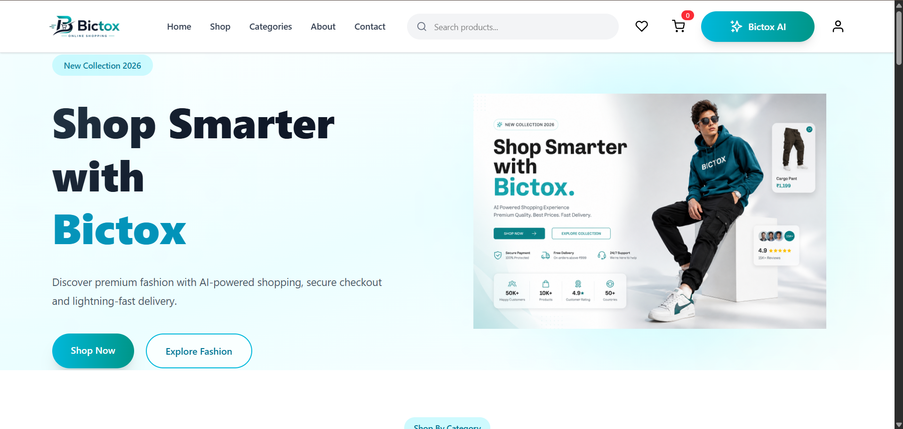

---

## 🛍️ Shop Page

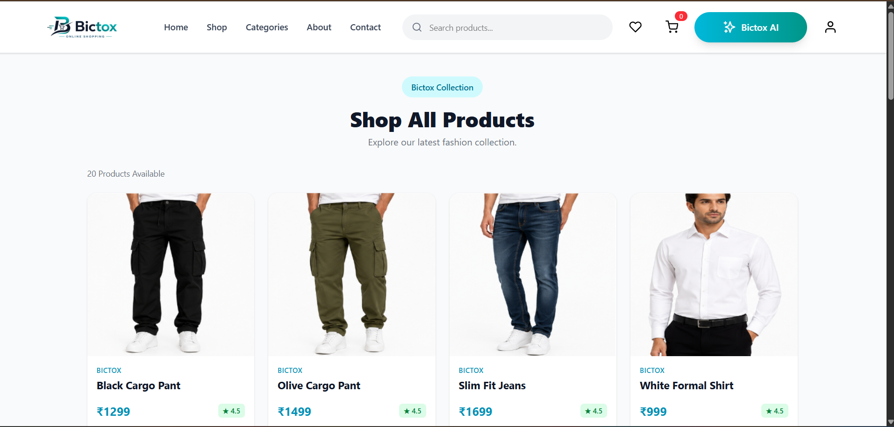

---

## 📄 Product Details

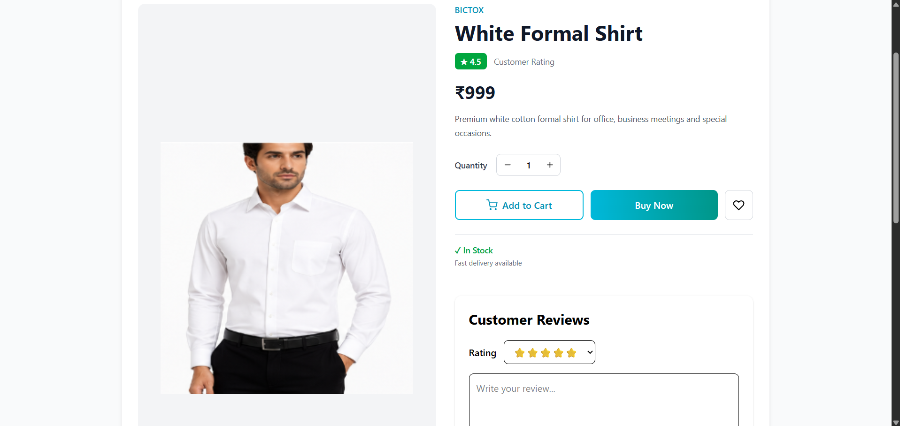

---

## ❤️ Wishlist

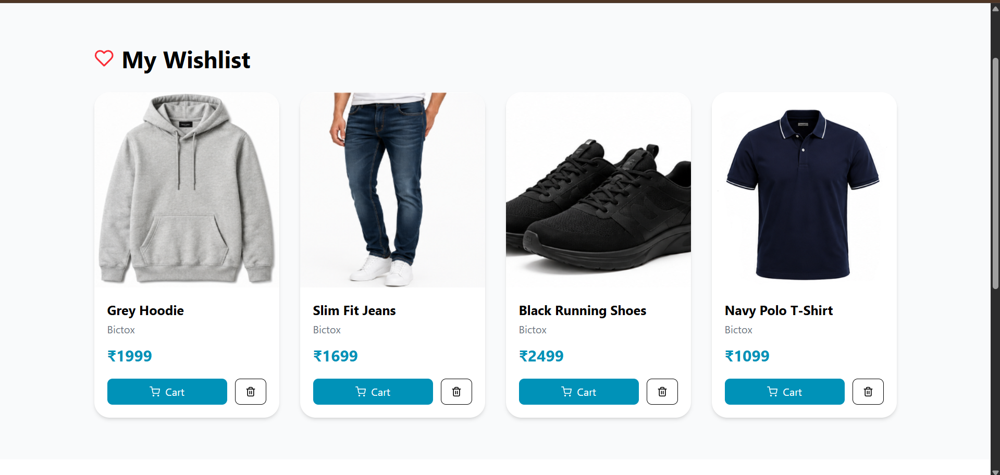

---

## 🛒 Cart

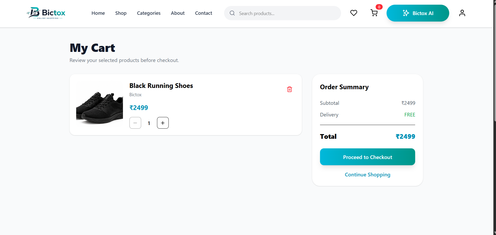

---

## 💳 Checkout

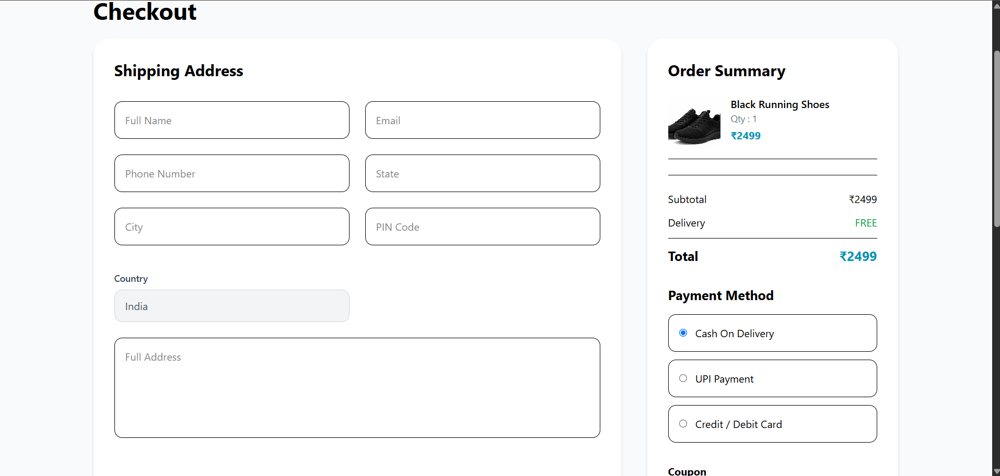

---

## 🤖 Bictox AI Assistant

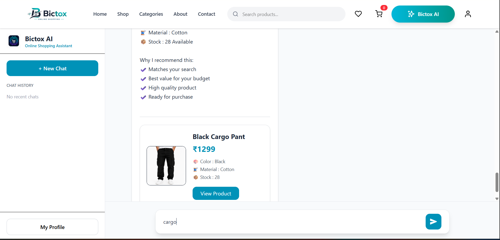

---

## 👤 My Profile

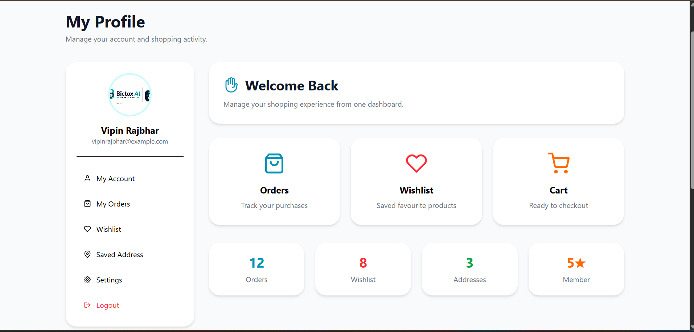

---

## 📦 Orders

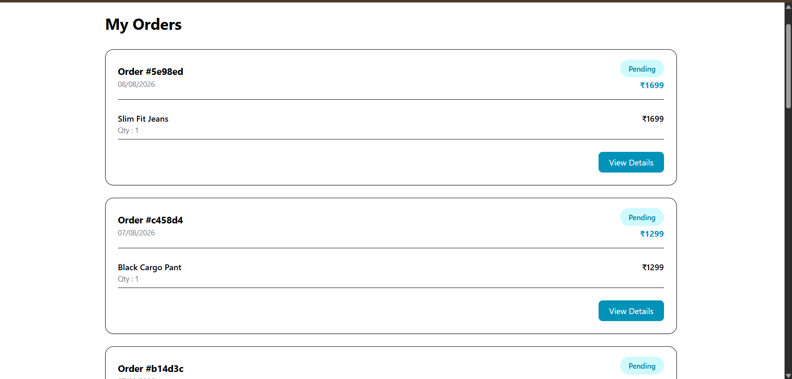

---

## 📞 Contact Page

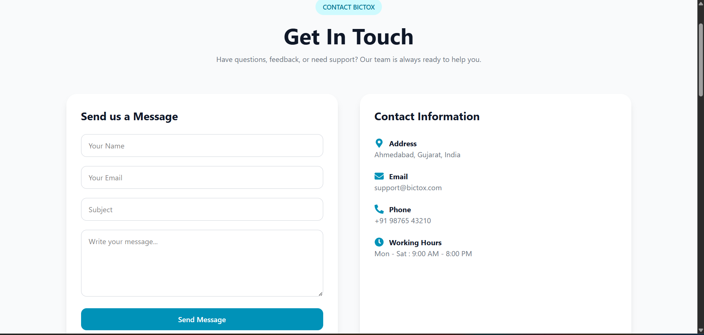

---

## ℹ️ About Page

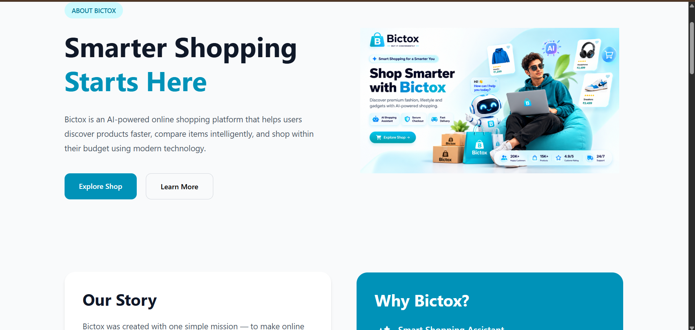

---

# 👨‍💻 Author

**Vipin Rajbhar**

B.Tech Computer Science Engineering Student

Frontend & Full Stack Web Developer

Project: **Bictox Online Shopping**

---

# 🤝 Contributing

Contributions, suggestions, and feature requests are welcome.

If you have ideas to improve this project, feel free to fork the repository and submit a pull request.

---

# 📄 License

This project is developed for educational, learning, and portfolio purposes.

---

# ⭐ Support

If you found this project helpful, consider giving it a ⭐ on GitHub.

It helps support future development and motivates further improvements.

---

# ❤️ Thank You

Thank you for visiting the **Bictox Online Shopping** project.

We hope you enjoy exploring the platform.

Happy Shopping! 🛍️
